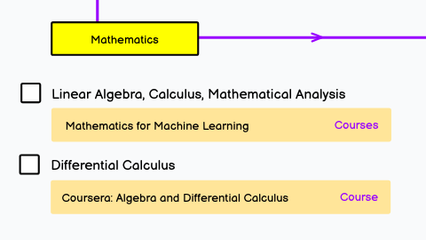

## Mathematics
This branch will explore and practice concepts related to basic mathematics in AI and data science.

 
 

---
[AI and Data Scientist Roadmap](https://roadmap.sh/ai-data-scientist?s=65dd2a1daec67f2e2aa43593) 
offers a comprehensive guide for individuals interested in AI and data engineering, designed by 
[Kamran Ahmed](https://github.com/kamranahmedse/developer-roadmap).

---

