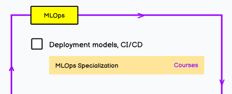

## Machine Learning Operations (MLOps)
This branch will explore and practice machine learning production. MLOps is a core function of Machine Learning engineering, focused on streamlining the process of taking machine learning models to production, maintaining and monitoring them.

 
 

---
[AI and Data Scientist Roadmap](https://roadmap.sh/ai-data-scientist?s=65dd2a1daec67f2e2aa43593) designed by 
[Kamran Ahmed](https://github.com/kamranahmedse/developer-roadmap), 
offers a comprehensive guide for individuals interested in AI and data engineering.

---

