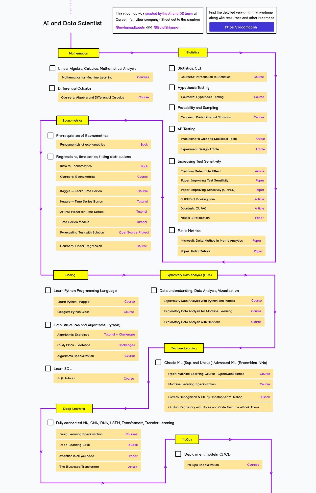

## AI and Data Science
[AI and Data Scientist Roadmap](https://roadmap.sh/ai-data-scientist?s=65dd2a1daec67f2e2aa43593) 
offers a comprehensive guide for individuals interested in AI and data engineering, designed by 
[Kamran Ahmed](https://github.com/kamranahmedse/developer-roadmap).

This repository is a collaborative workspace to explore and practice different concepts related to "AI and Data Scientist Roadmap", including 
[basic mathematics in ML](https://github.com/Milad-Mrz/AI_and_Data_Science/tree/1-Mathematics), 
[statistics](https://github.com/Milad-Mrz/AI_and_Data_Science/tree/2-Statistics), 
[econometrics](https://github.com/Milad-Mrz/AI_and_Data_Science/tree/3-Econometrics),
[coding](https://github.com/Milad-Mrz/AI_and_Data_Science/tree/4-Coding), 
[exploratory data analysis (EDA)](https://github.com/Milad-Mrz/AI_and_Data_Science/tree/5-EDA), 
[machine learning](https://github.com/Milad-Mrz/AI_and_Data_Science/tree/6-ML), 
[deep learning](https://github.com/Milad-Mrz/AI_and_Data_Science/tree/7-DL),
and [MLOps](https://github.com/Milad-Mrz/AI_and_Data_Science/tree/8-ML-OPS).

